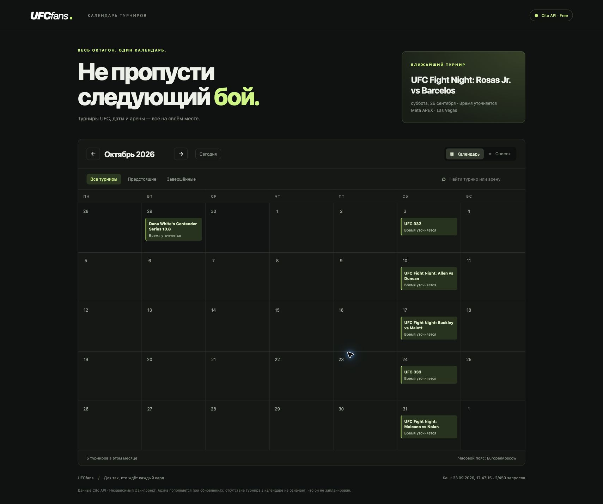
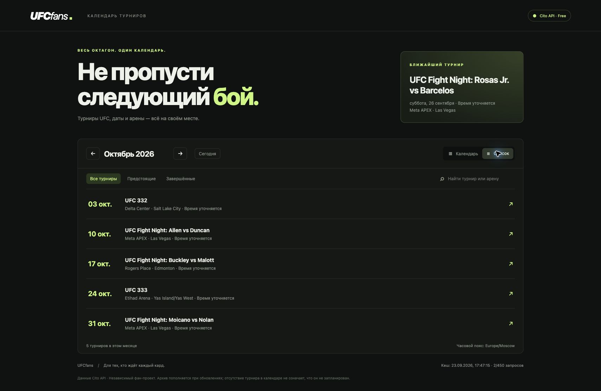
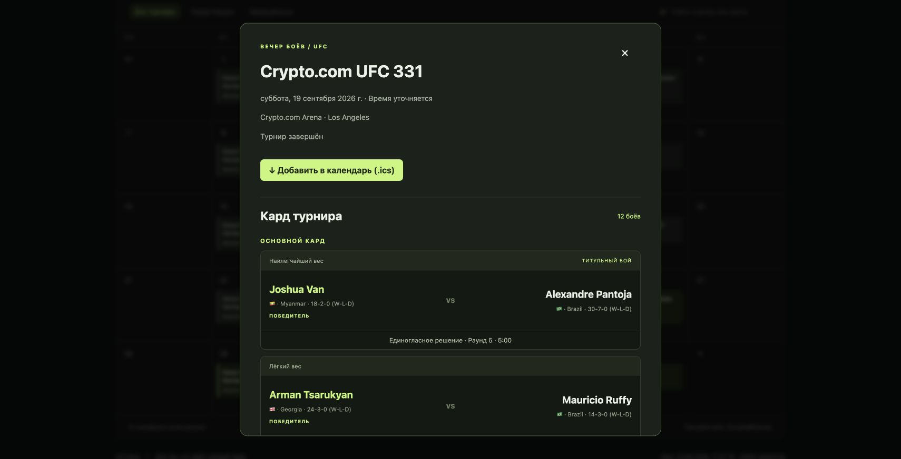
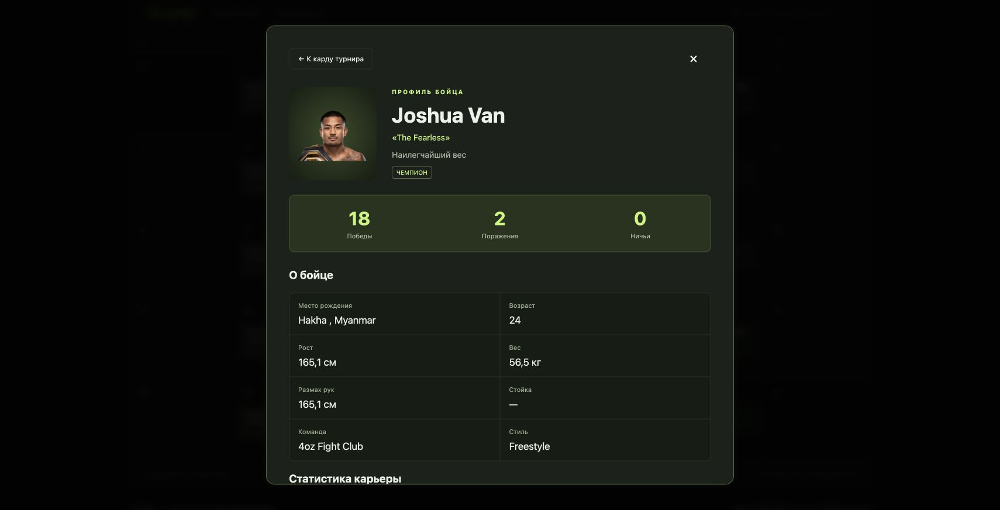

# UFCfans

Веб-календарь турниров UFC: Go 1.23+, встроенный UI на HTML/CSS/JavaScript, без внешних зависимостей.

## Как выглядит приложение

Скриншоты рабочего приложения с данными Cito API, сделанные 23 сентября 2026 года. На экране выбран октябрь 2026 года; расписание может измениться.

### Календарь турниров

Обзор месяца, ближайший турнир, поиск и фильтры.



### Список турниров

Даты, названия турниров, арены и города в компактном списке.



### Карточка турнира

Дата и место проведения, полный опубликованный кард с результатами и кнопка экспорта в календарь `.ics`.



### Профиль бойца

Нажмите на имя в карде, чтобы посмотреть рекорд, параметры, статистику и рейтинги.



## Запуск

```sh
export CITO_API_KEY='ваш ключ Cito API'
go run .
```

Откройте http://127.0.0.1:4453. Без ключа доступен экран подключения и явный деморежим с вымышленными турнирами. Ключ можно получить на https://citoapi.com/dashboard.

Настройки окружения: `CITO_API_KEY`, `ADDR` (по умолчанию `127.0.0.1:4453`), `CACHE_FILE` (по умолчанию `data/calendar.json`). При старте автоматически загружается `.env` из текущей директории (пример — `.env.example`). Уже заданные переменные окружения имеют приоритет. Значения читаются буквально, без выполнения shell-команд. После изменения `.env` перезапустите сервер. Для внешнего доступа настройте `ADDR`, например `:4453`.

```sh
go test -race ./...
go vet ./...
go build -o ufcfans .
./ufcfans
```

В текущем окружении Go 1.23.1 имеет неполную стандартную библиотеку. Рабочая команда с уже установленным toolchain: `env -u GOROOT GOTOOLCHAIN=go1.25.3 go run .` (аналогично для тестов и сборки). Готовый бинарный файл можно запустить через `./ufcfans` без Go.

## Возможности

- Календарь по месяцам и список, поиск по названию/арене, фильтр предстоящих и завершённых турниров.
- Ближайший турнир, карточка события и экспорт `.ics`.
- Полный опубликованный кард: основной и предварительные разделы, пары бойцов, рекорды, весовые категории, титульные и отменённые бои, победители и результаты.
- Часовой пояс браузера; даты без времени сохраняются как события на весь день.
- UI встроен в исполняемый файл; CDN, npm и сборка фронтенда не нужны.

- Профили бойцов по нажатию на имя в карде: фото, рекорд, возраст, рост, вес, размах рук, команда, статистика карьеры и рейтинги. Возврат к карду сохраняет его положение.

## Бесплатный тариф и кеш

Сервер получает `/ufc/events/upcoming` и `/ufc/events/recent` при первом открытии и затем по запросу пользователя, только если кеш старше 12 часов. Обычно это не более 4 запросов в сутки (124 за 31 день). При открытии турнира сервер загружает `/ufc/events/{id}/bouts`: один дополнительный запрос на кард с кешем на 12 часов. Повторное открытие использует кеш; при ошибке сохраняется предыдущий кард, следующая попытка — через час. Профиль `/ufc/fighters/{slug}` загружается одним запросом вместе со статистикой и рейтингами и кешируется на 24 часа. При ошибке используется сохранённый профиль, повторы ограничены одним в час. Календарь, карды и профили делят общий лимит 450 запросов в месяц и 10 в минуту. Навигация по месяцам, поиск и экспорт не вызывают Cito API. Фонового опроса нет.

События, время обновления и счётчик запросов сохраняются на диск с правами 0600. Ошибки тоже расходуют локальный счётчик; повтор возможен не раньше чем через час. При недоступности API показываются старые данные. Внутренний предел — 450 запросов за календарный месяц UTC, оставляя запас от бесплатных 500. Это счётчик данного экземпляра, а не остаток аккаунта: использование ключа в других приложениях здесь не учитывается. Запускайте один экземпляр на один файл кеша; удаление файла сбрасывает локальный учёт.

Архив накапливается из загруженных данных. Полный исторический архив не скачивается. Пустой месяц означает отсутствие загруженных событий. Последние опубликованные данные имеют приоритет; исчезнувшее из API событие остаётся в локальном архиве, поэтому отмены, которые API не сообщает явно, требуют отдельной сверки.

Документация: https://citoapi.com/docs/api/ufc/events/
Free: https://citoapi.com/free-ufc-api/ — 500 запросов/месяц, 10/минуту, без коммерческого использования. Платные endpoints и live в приложении не используются.

## Проверка интеграции

Тесты проверяют кеш, сохранение квоты, ограничение повторов после 429, сохранение старых данных и отсутствие запросов без ключа. Интеграция проверена с личным ключом из `.env`: endpoints upcoming и recent успешно вернули 21 событие за 2 запроса (23 сентября 2026). Парсер поддерживает массив `data` и `data.events`, распространённые поля даты и форматы RFC3339 / YYYY-MM-DD. Неподдерживаемый формат не заменяет рабочий кеш.
